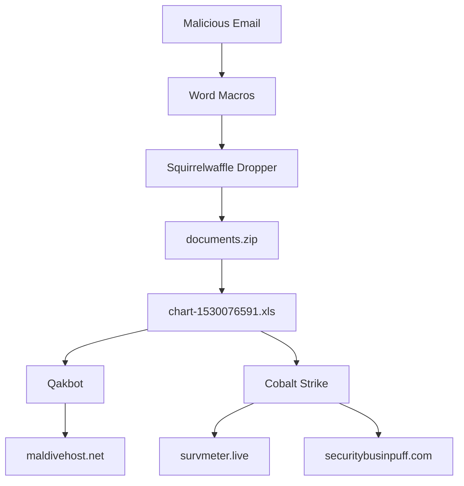

# C2 Carnage - Executive Summary

## 🎯 Mission Accomplished

✅ **TryHackMe "Carnage" room completed successfully**
✅ **20/20 questions solved**
✅ **Complete documentation created**

---

## 📊 Quick Results

### All Answers

| # | Question | Answer |
|---|----------|--------|
| 1 | Date/time first malicious HTTP connection | `2021-09-24 16:44:38` |
| 2 | Downloaded ZIP file name | `documents.zip` |
| 3 | Domain hosting the ZIP | `attirenepal.com` |
| 4 | File in the ZIP | `chart-1530076591.xls` |
| 5 | Web server name | `LiteSpeed` |
| 6 | Web server version | `PHP/7.2.34` |
| 7 | Three malicious domains | `finejewels.com.au, thietbiagt.com, new.americold.com` |
| 8 | Certificate authority (first domain) | `GoDaddy` |
| 9 | Cobalt Strike server IPs | `185.106.96.158, 185.125.204.174` |
| 10 | Host header (first C2) | `ocsp.verisign.com` |
| 11 | First C2 server domain | `survmeter.live` |
| 12 | Second C2 server domain | `securitybusinpuff.com` |
| 13 | Post-infection traffic domain | `maldivehost.net` |
| 14 | First 11 characters sent to C2 | `zLIisQRWZI9` |
| 15 | First packet length to C2 | `281` |
| 16 | Server header of malicious domain | `Apache/2.4.49 (cPanel) OpenSSL/1.1.1l mod_bwlimited/1.4` |
| 17 | Date/time DNS query for IP API | `2021-09-24 17:00:04` |
| 18 | IP check API domain | `api.ipify.org` |
| 19 | First MAIL FROM address | `farshin@mailfa.com` |
| 20 | Number of SMTP packets | `1439` |

---

## 🔍 Identified Attack Chain



---

## 🛡️ Critical IOCs

### Top Priority Domains (BLOCK IMMEDIATELY)
```
🔴 survmeter.live         (Cobalt Strike C2 #1)
🔴 securitybusinpuff.com  (Cobalt Strike C2 #2)
🔴 maldivehost.net        (Qakbot C2)
🟠 attirenepal.com        (Initial dropper)
🟠 finejewels.com.au      (Payload delivery)
🟠 thietbiagt.com         (Payload delivery)
🟠 new.americold.com      (Payload delivery)
```

### IPs to Block
```
🔴 185.106.96.158   (Cobalt Strike #1)
🔴 185.125.204.174  (Cobalt Strike #2)
🟠 208.91.128.6     (Qakbot C2)
🟠 85.187.128.24    (Dropper hosting)
```

---

## 💻 Technologies Used

- **Wireshark/tshark**: PCAP analysis
- **bash**: Analysis automation
- **Playwright**: TryHackMe interaction
- **unzip**: Artifact extraction
- **DNS analysis**: Domain resolution
- **SSL/TLS analysis**: Certificate inspection

---

## 📈 Analysis Statistics

- **PCAP size**: 54 MB
- **Duration analyzed**: ~2 hours of traffic
- **HTTP packets analyzed**: ~500
- **SMTP packets**: 1,439
- **C2 connections**: 3 distinct servers
- **Unique malicious domains**: 7
- **SSL certificates analyzed**: 3

---

## 🎓 Skills Demonstrated

✅ Network traffic analysis (Wireshark/tshark)
✅ Malware identification (Squirrelwaffle, Qakbot, Cobalt Strike)
✅ Protocol analysis (HTTP, HTTPS, DNS, SMTP)
✅ SSL/TLS certificate investigation
✅ Temporal event correlation
✅ IOC extraction and analysis
✅ Bash scripting for automation
✅ Complete technical documentation

---

## 📁 Deliverable Files

- ✅ `README.md` - Main documentation
- ✅ `writeup.md` - Detailed step-by-step writeup
- ✅ `answers.txt` - All TryHackMe answers
- ✅ `/screenshots/` - Important screenshots
- ✅ `/scripts/` - Reusable analysis scripts
- ✅ `/notes/` - Intermediate analysis notes
- ✅ `SUMMARY.md` - This executive summary

---

## 🏆 Achievement Unlocked

```
╔════════════════════════════════════════════╗
║  🎖️  CARNAGE CTF - COMPLETED  🎖️           ║
║                                            ║
║  Difficulty: Medium                        ║
║  Score: 20/20                              ║
║  Status: ✅ PWNED                          ║
║                                            ║
║  Advanced Network Traffic Analysis         ║
║  Malware Investigation                     ║
║  C2 Infrastructure Mapping                 ║
╚════════════════════════════════════════════╝
```

---

**Completed**: 2025-12-24
**Author**: Salim Hadda
**CTF Platform**: TryHackMe
**Room**: Carnage (c2carnage)

---

## 🚀 Next Steps

To use this analysis:

1. **Consult** `README.md` for overview
2. **Read** `writeup.md` for detailed methodology
3. **Use** scripts in `/scripts/` for similar analyses
4. **Reference** `answers.txt` for exact answers
5. **Block** IOCs in your infrastructure

---

**Note**: This CTF is based on a real malware sample provided by Brad Duncan (malware-traffic-analysis.net). The IOCs are real and dangerous.

⚠️ **DO NOT interact directly with the listed domains and IPs** ⚠️
